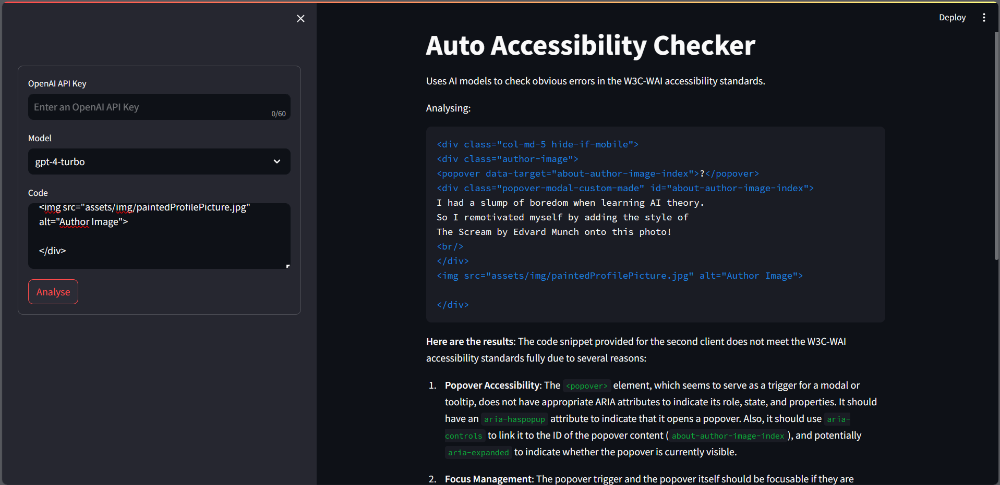

## Auto Accessibility Checker



This is a rough tool to check the accessibility of a website. It uses OpenAI's GPT-3 on the backend and streamlit on the frontend. **The tool is not perfect**. It's a first pass to help save time.

### Installation
**You'll need an OpenAI API Key to use the project.** You can get one at [platform.openai.com](https://platform.openai.com/).

First, clone this repository by running
```bash
git clone https://github.com/phac-aspc/auto-accessibility-checker
```

Then, install the dependencies by running
```bash
pip3 install -r requirements.txt
```
(Use pip3 not pip)

Finally, run the project by running
```bash
streamlit run frontend.py
```